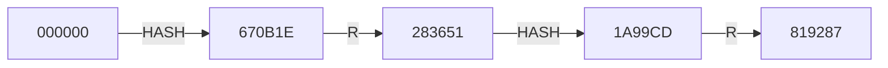
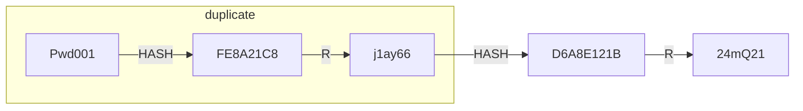
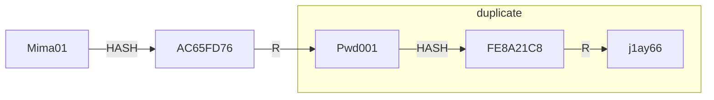
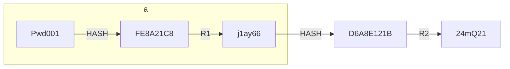
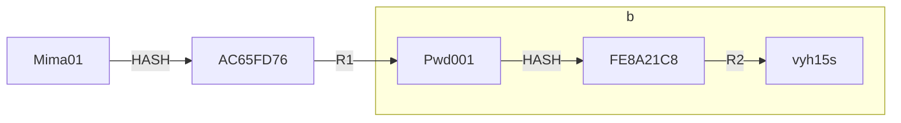

<style>
  .list-unstyled ul{
    list-style-type: none;
  }
  .list-unstyled li{
    margin-bottom: 1rem;
  }
</style>

# 相关知识

## 验证主密码

References:

- [加盐hash保存密码的正确方式](https://wooyun.js.org/drops/%E5%8A%A0%E7%9B%90hash%E4%BF%9D%E5%AD%98%E5%AF%86%E7%A0%81%E7%9A%84%E6%AD%A3%E7%A1%AE%E6%96%B9%E5%BC%8F.html)
- [Salt and hash a password in Python](https://stackoverflow.com/questions/9594125/salt-and-hash-a-password-in-python/56915300#56915300)

### Hash算法

Hash算法是一种单向的函数。它可以把任意数量的数据转换成固定长度的“指纹”，这个过程是不可逆的。而且只要输入发生改变，哪怕只有一个bit，输出的hash值也会有很大不同。这种特性恰好合适用来用来保存密码。因为我们希望使用一种不可逆的算法来加密保存的密码，同时又需要在用户登陆的时候验证密码是否正确。

在一个使用Hash的账号系统中，用户注册和认证的大致流程如下：

1. 用户创建自己的账号。
2. 用户密码经过Hash操作之后存储在数据库中，即用于登录密码管理系统的主密码经Hash处理后，存储的只是其hash值。
3. 用户登陆的时候，将用户输入的密码进行Hash操作后与数据库里保存的密码hash值进行对比。
4. 如果hash值完全一样，则认为用户输入的密码是正确的；否则就认为用户输入了无效的密码。
5. 每次用户尝试登陆的时候就重复步骤3和步骤4。

在步骤4中，永远不要告诉用户输错的究竟是用户名还是密码。就像通用的提示那样，始终显示：“无效的用户名或密码”。这样可以防止攻击者在不知道密码的情况下枚举出有效的用户名。

应当注意的是，用来保护密码的哈希函数，和数据结构课学到的哈希函数是不同的。例如，实现哈希表的哈希函数设计目的是快速查找，而非安全性。只有加密哈希函数（cryptographic hash function）才可以用来进行密码哈希加密。像SHA256、SHA512、RIPEMD和WHIRLPOOL都是加密哈希函数。

### 如何破解Hash？

#### 彩虹表（Rainbow Tables）

彩虹表是一种以空间换时间的技术。与查表法相似，只是它为了使查询表更小，牺牲了破解速度。因为彩虹表更小，所以在单位空间可以存储更多的哈希值，从而使攻击更有效。能够破解任何最多8位长度的MD5值的彩虹表已经出现。

单向HASH算法由于不能进行解密运算，只能通过建表、查表的方式进行碰撞，即将常用的密码及其对应的hash值全计算出来并存储，当获取到HASH值时，直接查表获取原始密码。假设用MD5算法来保护6位数字密码，可以建如下表：

|原始密码|MD5值|
|---|---|
|000000|670B14728AD9902AECBA32E22FA4F6BD|
|000001|04FC711301F3C784D66955D98D399AFB|
|...|...|
|999999|52C69E3A57331081823331C4E69D3F2E|

全表共100万条记录，因为数据量不大，建表、查表都非常容易。但是当密码并不是6位纯数字密码，而是数字、大小写字母结合的10位密码时，建立一个这样的表需要（26 + 26 + 10）^ 10 ≈ 83亿亿条记录，存储在硬盘上至少要占用2000万TB的空间，这么大的存储空间，成本太大，几乎不可行。

有什么办法可以减少存储空间？一种方法是“预计算哈希链”。“预计算哈希链”可以大幅减少hash表的存储空间，但相应的增加了查表时的计算量，其原理大致如下：

##### 建表过程

<!-- Mermaid syntax -->
<!-- https://mermaid.js.org/syntax/flowchart.html -->



先对原始数据“000000”进行一次HASH运算得到“670B1E”，再对hash值进行一次R运算（R是一个定制的算法，可以将hash值映射到明文空间上，这里我们的明文空间是000000~999999），R运算后得到“283651”，再对“283651”进行HASH运算得到“1A99CD”，然后再进行R运算得到“819287”，如此重复多次，得到一条哈希链。然后再选用其它原始数据建立多条哈希链。最终仅将链头和链尾保存下来，中间节点全都去掉。

##### 查表过程

假设拿到了一条hash值“670B1E”，首先进行一次R运算，得到了“283651”，查询所有链尾是否有命中，如果没有，则再进行一次HASH、一次R，得到了“819287”，可以看出已经命中链尾，这样我们就可以基本确认“670B1E”对应的明文就在这条链上。然后我们把这条链的生成过程进行重新计算，计算过程中可以发现“000000”的hash值就是“670B1E”，这样就完成了整个查表过程。这种表就是“预计算哈希链”。

##### 重链问题

上述方式存在一个问题，多条链之间可能存在大量的重复数据，如下图所示：





为了解决这个问题，我们将R算法进行扩展，一条链上的多次R运算采用不同的算法，如下图：





一条链上的每个R算法都不一样，就像彩虹的每层颜色一样，因此取名的为彩虹表。

彩虹表除了可以用于破解HASH算法外，理论上还可以用于破解对称加密算法，比如DES算法，由于DES算法密钥比较短，建立彩虹表破解是完全可行的；但对于AES算法，由于密钥比较长，建表几乎不可行。

#### 字典攻击和暴力攻击（Dictionary and Brute Force Attacks）

破解哈希加密最简单的方法是尝试猜测密码，即HASH每个猜测的密码，并对比猜测密码的hash值是否等于目标hash值。猜测密码攻击的两种最常见的方法是字典攻击和暴力攻击。

字典攻击使用包含单词、短语、常用密码和其他可能用做密码的字符串的字典文件。对文件中的每个词都进行哈希加密，将这些hash值和要破解的密码hash值比较。字典文件是通过大段文本中提取的单词构成，甚至还包括一些数据库中真实的密码。

暴力攻击是对于给定的密码长度，尝试每一种可能的字符组合。这种方式会消耗大量的计算，也是破解哈希加密效率最低的办法，但最终会找出正确的密码。因此密码应该足够长，以至于遍历所有可能的字符组合，耗费的时间太长令人无法承受，从而放弃破解。

目前没有办法阻止字典攻击或暴力攻击，只能想办法让它们变得低效。如果密码哈希系统设计是安全的，破解唯一方法就是进行字典攻击或暴力攻击遍历每一个hash值了。

#### 查表法（Lookup Tables）

对于破解相同类型的哈希值，查表法是一种非常高效的方式。主要理念是预先计算（pre-compute）出密码字典中的每个密码的hash值，并将其存储到一个表里。一个设计良好的查询表结构，即使包含了数十亿个hash值，仍然可以实现每秒钟查询数百次。

#### 反向查表法（Reverse Lookup Tables）

这种攻击允许攻击者无需预先计算好查询表的情况下同时对多个哈希值发起字典攻击或暴力攻击。

首先，攻击者利用被黑的用户帐号数据库创建一个用户名和对应密码的哈希表。然后，攻击者使用该查询表内的密码hash值来查找使用对应密码的用户。通常许多用户都会使用相同的密码，因此这种攻击方式特别有效。

### 加盐

*查表*和*彩虹表*的方式之所以有效是因为每一个密码的都是通过同样的方式来进行Hash的。如果两个用户使用了同样的密码，那么一定他们的密码hash值也一定相同。

我们可以通过让每一个Hash随机化，同一个密码Hash两次，得到的不同的hash值来避免这种攻击。

具体的操作就是给密码加一个随机的前缀或者后缀，然后再进行Hash。这个随即的后缀或者前缀称为“盐”。通过加盐，相同的密码每次Hash都是完全不一样的字符串了。检查用户输入的密码是否正确的时候，我们也还需要这个盐，所以盐一般都是跟hash值一起保存在数据库里，或者作为hash字符串的一部分。

*盐不需要保密*，只要盐是随机的，*查表*、*彩虹表*都会失效。因为攻击者无法事先知道盐是什么，也就没有办法预先计算出查询表和彩虹表。如果每个用户都是使用了不同的盐，那么*反向查表*攻击也没法成功。

每一个用户，*每一个密码都要使用不同的盐*。用户每次创建账户或者修改密码都要使用一个新的随机盐。永远不要重复使用盐。盐的长度要足够，一个经验规则就是*盐的长度至少要跟hash函数输出的长度一致*。盐应该跟hash值一起存储在用户信息表里。

### 总结

#### 存储一个密码

1. 使用CSPRNG生成一个长的随机盐。A cryptographically secure pseudorandom number generator (CSPRNG) or cryptographic pseudorandom number generator (CPRNG) is a pseudorandom number generator (PRNG) with properties that make it suitable for use in cryptography.
2. 将密码和盐拼接在一起，使用标准的加密hash函数比如SHA256进行Hash。
3. 将盐和hash值记录在用户数据库中。

#### 验证一个密码

1. 从数据库中取出用户的盐和hash值。
2. 将用户输入的密码和盐按相同方式拼接在一起，使用相同的hash函数进行Hash。
3. 比较计算出的hash值跟存储的hash值是否相同。如果相同则密码正确，反之则密码错误。

### `hashlib`介绍

This module implements a common interface to many different secure hash and message digest algorithms. Included are the FIPS secure hash algorithms SHA1, SHA224, SHA256, SHA384, and SHA512 (defined in FIPS 180-2) as well as RSA’s MD5 algorithm (defined in internet RFC 1321). The terms "secure hash" and "message digest" are interchangeable.

There is one constructor method named for each type of hash. All return a hash object with the same simple interface. For example: use `sha256()` to create a SHA-256 hash object. You can now feed this object with bytes-like objects (normally bytes) using the `update()` method. At any point you can ask it for the digest of the concatenation of the data fed to it so far using the `digest()` or `hexdigest()` methods.

```sh
>>> import hashlib
>>> m = hashlib.sha256() # Use constructor method to create a SHA-256 hash object
>>> m.update(b"Nobody inspects") # Update the hash object with the bytes-like object. Repeated calls are equivalent to a single call with the concatenation of all the arguments: m.update(a); m.update(b) is equivalent to m.update(a+b).
>>> m.update(b" the spammish repetition")
>>> m.digest() # Return the digest, i.e., the resulting secure hash, of the data passed to the update() method so far. This is a bytes object of size digest_size which may contain bytes in the whole range from 0 to 255.
b'\x03\x1e\xdd}Ae\x15\x93\xc5\xfe\\\x00o\xa5u+7\xfd\xdf\xf7\xbcN\x84:\xa6\xaf\x0c\x95\x0fK\x94\x06'
>>> m.hexdigest()
'031edd7d41651593c5fe5c006fa5752b37fddff7bc4e843aa6af0c950f4b9406'
>>> m.digest_size
32
>>> m.block_size
64
```

More condensed:

```sh
>>> hashlib.sha256(b"Nobody inspects the spammish repetition").hexdigest()
'031edd7d41651593c5fe5c006fa5752b37fddff7bc4e843aa6af0c950f4b9406'
```

#### Randomized hashing

By setting *salt* parameter users can introduce randomization to the hash function. Randomized hashing is useful for protecting against collision attacks on the hash function used in digital signatures.

In BLAKE2 the salt is processed as a one-time input to the hash function during initialization, rather than as an input to each compression function.

```sh
>>> import os
>>> from hashlib import blake2b
>>> msg = b'some message'
# Calculate the first hash with a random salt.
>>> salt1 = os.urandom(blake2b.SALT_SIZE) # os.urandom uses system entropy sources to have better random generation. This method returns a random bytes suitable for cryptographic use.
>>> h1 = blake2b(salt=salt1)
>>> h1.update(msg)
# Calculate the second hash with a different random salt.
>>> salt2 = os.urandom(blake2b.SALT_SIZE)
>>> h2 = blake2b(salt=salt2)
>>> h2.update(msg)
# The digests are different.
>>> h1.digest() != h2.digest()
True
```

> Warning: Salted hashing (or just hashing) with BLAKE2 or any other general-purpose cryptographic hash function, such as SHA-256, is not suitable for hashing passwords.
>
> Q: So I shouldn't use BLAKE2 for hashing user passwords?
> A: You shouldn't use *any* general-purpose hash function for user passwords, not BLAKE2, and not MD5, SHA-1, SHA-256, or SHA-3. Instead you should use a password hashing function such as the Password Hashing Competition winner Argon2 with appropriate time and memory cost parameters, to mitigate the risk of bruteforce attacks — Argon2's core uses a variant of BLAKE2's permutation.

### Why shouldn't use general-purpose hash function for passwords

While salting will increase the time it takes to crack a salted hash, it is merely a bump in the road if users use passwords such as "123456".

Why? Because the salt is typically stored with the hashed password, so if the user selects "123456", the cracker just selects a dictionary with this password and then adds the salt, and compares it. Every one of these passwords, from the LinkedIn password breach in 2012, would have been cracked almost instantly on standard GPU hardware (such as with an NVIDIA graphic card or from an AWS GPU instance).

So, if the salt is kept with the hashed password, as most systems do, weak passwords from dictionaries would have been easily cracked.

> In particular, LinkedIn failed to adequately protect user data because it stored passwords in unsalted SHA1 hashed format.

**BCrypt** uses salting and then defines a number of rounds, and where an extra round doubles the time taken to compute a hash.

With Bcrypt we get a number of rounds for the hashing, so if the number of rounds is increased from 6 to 16, it is over 1,000 times more difficult to crack. if increased to 31, it is over 33 million times more difficult (2²⁵). The penalty is that it is slower to hash, so there a sweet spot.

#### A few basics

There are four related core concepts in cryptography:

- public key encryption (asymmetric encryption): RSA, DSA
- private key encryption (symmetric encryption): RC2, RC4, DES, 3DES, AES
- one-way hash: MD5, SHA-1, SHA-256
- and encoding: Base64, Hex, Octal, Unicode

All of the methods above allow for the easy reverse of the encryption or encoding process if the key is known, apart from one-way hashing where it should be almost impossible to reverse back the hashed value to the original data.

Unfortunately technology has moved on since the creation of hashing methods, and they can often be easily cracked using brute force (where an intruder keeps hashing values until the output matches the hash) using a dictionary of common passwords, or use a rainbow table (which has a pre-compiled list of hash values).

These days MD5 and SHA-1 are seen as weak for many reasons, so we often start with SHA-256 (which produces a 256-bit hashed value):

```txt
Hash = sha256(password)
```

Unfortunately this is weak from both a dictionary attack and brute force, so we add some salt:

```txt
Hash = salt + sha256(salt + password)
```

Now this becomes more difficult as the same password is likely to produce a different output. Before, with simple hashing, if one hashed password was cracked, all the other passwords with the same value will also be cracked.

The weakness of salting is that the salt requires to be stored with the password, so the intruder just uses a fast computer — such as using NVIDIA graphics cards on the Amazon Cloud — and tries all the main passwords (passwords exposed in data breaches), and is able to determine the original password. The reason this happens is because *SHA256 has been designed to be fast*, so the intruder uses this for their advantage, and can quickly try lots of passwords. If the password is weak and in a dictionary it is relatively easy for the intruder.

One solution is to use a hashing method which slows down the process of hashing, adds a bit of salt, and then iterates. This makes it extremely difficult to compile the list of hashes, as it is computationally expensive to compute them — on the Cloud time is money, so a computationally difficult challenge many take years to complete and thus be costly.

#### PBKDF2

One of the best around for hashing passwords is PBKDF2 (Password-Based Key Derivation Function 2) and is defined in RFC 2898. It is used in TrueCrypt to generate the key required to read the header information of the encrypted drive, and which stores the encryption keys, and also in WPA-2 to protect the wi-fi password for the pre-shared key. If you’re interested, here’s an overview: <https://youtu.be/OXT8xqWww6U>

#### Bcrypt

MD5 and SHA-1 produce a hash signature, but this can be attacked by rainbow tables. Bcrypt is a more powerful hash generator for passwords and uses salt to create a non-recurrent hash. It was designed by Niels Provos and David Mazières, and is based on the Blowfish cipher. It is used as the default password hashing method for BSD and other systems.

Not only does bcrypt include salts, it also makes brute force attacks substantially more difficult. bcrypt is considered “CPU-hardened”, which means that computing a hash requires many CPU cycles. You can also set the number of iterations using a work factor which makes it exponentially harder to brute force. As computers get faster and compute resources become less expensive, you can simply increase the bcrypt work factor to increase resource consumption.

Overall it uses a 128-bit salt value, which requires 22 Base64 characters. It can use a number of iterations, which will slow down any brute-force cracking of the hashed value.

For example, "Hello" with a salt value of `$2a$06$NkYh0RCM8pNWPaYvRLgN9.` gives:

```txt
$2a$06$NkYh0RCM8pNWPaYvRLgN9.LbJw4gcnWCOQYIom0P08UEZRQQjbfpy
```

As illustrated below, the first part is `$2a$` (or `$2b$`), and then followed by the number of rounds used `06$`. In this case, it is 6 rounds which is 2⁶ iterations (where each additional round doubles the hash time). The 128-bit (22 characters) salt values comes after this, then the separator `.`, and finally there is a 184-bit hash code (which is 31 characters).

The following provides an example of Bcrypt: <https://asecuritysite.com/encryption/bcrypt>

The slowness of Bcrypt is highlighted with a recent AWS EC2 server benchmark using hashcat ([here](http://blog.nullmode.com/blog/2015/03/22/36-core-aws-john/)):

> Hash type: MD5 Speed/sec: 380.02M words
> Hash type: SHA1 Speed/sec: 218.86M words
> Hash type: SHA256 Speed/sec: 110.37M words
> Hash type: bcrypt, Blowfish(OpenBSD) Speed/sec: 25.86k words
> Hash type: NTLM. Speed/sec: 370.22M words

You can see that Bcrypt is almost 15,000 times slower than MD5 (380,000,000 words/sec down to only 25,860 words/sec).

With John The Ripper password cracker:

> md5crypt [MD5 32/64 X2] 318237 c/s real, 8881 c/s virtual
> bcrypt (`$2a$05`, 32 iterations) 25488 c/s real, 708 c/s virtual
> LM [DES 128/128 SSE2–16] 88090K c/s real, 2462K c/s virtual

You can see that Bcrypt over 3,000 times slower than LM hashes.

Here is the Python implementation:

```python
from pbkdf2 import PBKDF2
import hashlib
import passlib.hash

salt="ZDzPE45C"
string="password"
salt2="1111111111111111111111"

print "General Hashes"
print "MD5:" + hashlib.md5(string).hexdigest()
print "SHA1:" + hashlib.sha1(string).hexdigest()
print "SHA256:" + hashlib.sha256(string).hexdigest()
print "SHA512:" + hashlib.sha512(string).hexdigest()

print "UNIX hashes (with salt)"
print "DES:" + passlib.hash.des_crypt.encrypt(string, salt=salt[:2])
print "MD5:" + passlib.hash.md5_crypt.encrypt(string, salt=salt)
print "Bcrypt:" + passlib.hash.bcrypt.encrypt(string, salt=salt2[:22])
print "Sun MD5:" + passlib.hash.sun_md5_crypt.encrypt(string, salt=salt)
print "SHA1:" + passlib.hash.sha1_crypt.encrypt(string, salt=salt)
print "SHA256:" + passlib.hash.sha256_crypt.encrypt(string, salt=salt)
print "SHA512:" + passlib.hash.sha512_crypt.encrypt(string, salt=salt)
```

and which gives:

```txt
General Hashes
MD5:5f4dcc3b5aa765d61d8327deb882cf99
SHA1:5baa61e4c9b93f3f0682250b6cf8331b7ee68fd8
SHA256:5e884898da28047151d0e56f8dc6292773603d0d6aabbdd62a11ef721d1542d8
SHA512:b109f3bbbc244eb82441917ed06d618b9008dd09b3befd1b5e07394c706a8bb980b1d7785e5976ec049b46df5f1326af5a2ea6d103fd07c95385ffab0cacbc86

UNIX hashes (with salt)
DES:ZD3yxA4N/XZVg
MD5:$1$ZDzPE45C$EEQHJaCXI6yInV3FnskmF1
Bcrypt:$2a$12$111111111111111111111uAQxS9vJNRtBb6zeFDV6k7tyB0DZJF0a
Sun MD5:$md5,rounds=34000$ZDzPE45C$$RGKsbBUBhidHsaNDUMEEX0
SHA1:$sha1$480000$ZDzPE45C$gfgoLWRrJHj/ZiXsV101NCX1GfUH
```

In this case we are using 12 iterations and a pre-prepared salt of "1111111111111111111111" (22 characters to give a 128-bit salt value).

We can increase the rounds to 20 with:

```python
print "Bcrypt:" + passlib.hash.bcrypt.encrypt(string, salt=salt2[:22], rounds=14)
```

to give:

```txt
Bcrypt:$2a$14$NkYh0RCM8pNWPaYvRLgN9.OcinBT2h.8NWt/KfmHQ5eIr/50zCt8q
```

#### Scrypt

Scrypt is a CPU-hardened function, but it also has the advantage of being memory-hard. That means it deliberately consumes more memory resources. In addition to specifying how much compute resources are required to compute an scrypt hash, you can also control how much memory is required. This means you can make computing scrypt hashes expensive by forcing attackers to acquire a large amount of both compute and memory resources.

Scrypt produces a hash with a salt and iterations. The iteration count slows down the cracking and the salt makes pre-computation difficult. The main parameters are: passphrase (P); salt (S); Blocksize (r) and CPU/Memory cost parameter (N — a power of 2). A demo is here: <https://asecuritysite.com/encryption/Scrypt>.

#### Argon2

Another less-established but promising hashing mechanism, Argon2, seems to offer the most flexibility yet. Argon2 adds a third dimension of complexity/cost: the number of threads used to compute the hash. This means that attackers need to have not only a large amount of compute and memory resources available but also more physical CPU cores. This makes brute force attacks substantially more expensive to execute.

#### Key derivation functions from `hashlib`

As of Python 3.4, the `hashlib` module in the standard library contains key derivation functions which are "designed for secure password hashing".

So use one of those, like `hashlib.pbkdf2_hmac`, with a salt generated using `os.urandom`:

```python
from typing import Tuple
import os
import hashlib
import hmac

def hash_new_password(password: str) -> Tuple[bytes, bytes]:
    """
    Hash the provided password with a randomly-generated salt and return the salt and hash to store in the database.
    """
    salt = os.urandom(16)
    pw_hash = hashlib.pbkdf2_hmac('sha256', password.encode(), salt, 100000)
    return salt, pw_hash

def is_correct_password(salt: bytes, pw_hash: bytes, password: str) -> bool:
    """
    Given a previously-stored salt and hash, and a password provided by a user trying to log in, check whether the password is correct.
    """
    return hmac.compare_digest(
        pw_hash,
        hashlib.pbkdf2_hmac('sha256', password.encode(), salt, 100000)
    )

# Example usage:
salt, pw_hash = hash_new_password('correct horse battery staple')
assert is_correct_password(salt, pw_hash, 'correct horse battery staple')
assert not is_correct_password(salt, pw_hash, 'Tr0ub4dor&3')
assert not is_correct_password(salt, pw_hash, 'rosebud')
```

Note that:

- The use of a 16-byte salt and 100000 iterations of PBKDF2 match the minimum numbers recommended in the Python docs. Further increasing the number of iterations will make your hashes slower to compute, and therefore more secure.
- `os.urandom` always uses a cryptographically secure source of randomness
- `hmac.compare_digest`, used in `is_correct_password`, is basically just the `==` operator for strings but without the ability to short-circuit, which makes it immune to timing attacks. [That probably doesn't really provide any extra security value](https://security.stackexchange.com/questions/9192/timing-attacks-on-password-hashes/9193#9193), but it doesn't hurt, either, so I've gone ahead and used it.
For theory on what makes a good password hash and a list of other functions appropriate for hashing passwords with, see <https://security.stackexchange.com/q/211/29805>.

##### The original documentation about key derivation

From: <https://docs.python.org/3/library/hashlib.html#key-derivation>

Key derivation and key stretching algorithms are designed for secure password hashing. Naive algorithms such as `sha1(password)` are not resistant against brute-force attacks. A good password hashing function must be tunable, slow, and include a [salt](https://en.wikipedia.org/wiki/Salt_%28cryptography%29) (random data that is used as an additional input to a one-way function that hashes data, a password or passphrase).

`hashlib.pbkdf2_hmac(hash_name, password, salt, iterations, dklen=None)`

<div class="list-unstyled">

- The function provides PKCS#5 password-based key derivation function 2. It uses HMAC as pseudorandom function.

- The string *hash_name* is the desired name of the hash digest algorithm for HMAC, e.g. 'sha1' or 'sha256'. *password* and *salt* are interpreted as buffers of bytes. Applications and libraries should limit password to a sensible length (e.g. 1024). *salt* should be about 16 or more bytes from a proper source, e.g. [os.urandom()](https://docs.python.org/3/library/os.html#os.urandom).
- The number of *iterations* should be chosen based on the hash algorithm and computing power. As of 2022, hundreds of thousands of iterations of SHA-256 are suggested. For rationale as to why and how to choose what is best for your application, read Appendix A.2.2 of [NIST-SP-800-132](https://nvlpubs.nist.gov/nistpubs/Legacy/SP/nistspecialpublication800-132.pdf). The answers on the [stackexchange pbkdf2 iterations question](https://security.stackexchange.com/questions/3959/recommended-of-iterations-when-using-pbkdf2-sha256/) explain in detail.
- *dklen* is the length of the derived key. If *dklen* is `None` then the digest size of the hash algorithm *hash_name* is used, e.g. 64 for SHA-512.

  ```sh
  >>> from hashlib import pbkdf2_hmac
  >>> our_app_iters = 500_000  # Application specific, read above.
  >>> dk = pbkdf2_hmac('sha256', b'password', b'bad salt'*2, our_app_iters)
  >>> dk.hex()
  '15530bba69924174860db778f2c6f8104d3aaf9d26241840c8c4a641c8d000a9'
  ```

- *New in version 3.4.*

- > Note A fast implementation of pbkdf2_hmac is available with OpenSSL. The Python implementation uses an inline version of hmac. It is about three times slower and doesn’t release the GIL.
- *Deprecated since version 3.10:* Slow Python implementation of *pbkdf2_hmac* is deprecated. In the future the function will only be available when Python is compiled with OpenSSL.

</div>

`hashlib.scrypt(password, *, salt, n, r, p, maxmem=0, dklen=64)`

<div class="list-unstyled">

- The function provides scrypt password-based key derivation function as defined in [RFC 7914](https://datatracker.ietf.org/doc/html/rfc7914.html).
- *password* and *salt* must be [bytes-like objects](https://docs.python.org/3/glossary.html#term-bytes-like-object). Applications and libraries should limit *password* to a sensible length (e.g. 1024). *salt* should be about 16 or more bytes from a proper source, e.g. `os.urandom()`.
- *n* is the CPU/Memory cost factor, *r* the block size, *p* parallelization factor and *maxmem* limits memory (OpenSSL 1.1.0 defaults to 32 MiB). *dklen* is the length of the derived key.

- *New in version 3.6.*

</div>

#### python-fastpbkdf2

[python-fastpbkdf2](https://github.com/Ayrx/python-fastpbkdf2) is a set of Python bindings for [fastpbkdf2](https://github.com/ctz/fastpbkdf2) with an interface compatible with the standard library's hashlib.pbkdf2_hmac. Initial testing shows that it is about 40% faster than the standard library implementation.

[fastpbkdf2 is a public domain PBKDF2-HMAC-{SHA1,SHA256,SHA512} which significantly outperforms others available. For example, it outperforms OpenSSL by about 4x and golang by about 6x.](https://jbp.io/2015/08/11/pbkdf2-performance-matters.html)

`python-fastpbkdf2` supports and is tested against Python versions 2.7, 3.3, 3.4, 3.5, 3.6.

##### Installation

python-fastpbkdf2 can be installed with pip:

```sh
pip install fastpbkdf2
```

`python-fastpbkdf2` depends on CFFI to bind C code. `libffi-dev` and `python-dev` may be required and can be installed with various package managers such as yum or apt-get.

##### How to use

`python-fastpbkdf2` provides an interface compatible wtih `hashlib.pbkdf2_hmac`. The module contains a single function that can be imported in place of `hashlib.pbkdf2_hmac`.

```python
from fastpbkdf2 import pbkdf2_hmac
```

## 加密内容信息

We can use module `cryptography` in Python that generates a symmetric key for encrypting and decrypting data. Once we encrypted data using a symmetric key, it generates encrypted text for input data. Later, we require the same symmetric key for decrypting the encrypted text. We must preserve this symmetric key in a safe and secure location; otherwise, we cannot retrieve the decrypted data.

The `cryptography` library provides a high-level interface for encryption and decryption in Python. Here's an example of how to use `cryptography` to encrypt and decrypt a message using the AES (Advanced Encryption Standard) algorithm:

```python
from cryptography.fernet import Fernet

# Generate a key
key = Fernet.generate_key()

# Create a Fernet object with the key
fernet = Fernet(key)

# Define the message to be encrypted
message = b'This is the message to be encrypted'

# Encrypt the message
encrypted_message = fernet.encrypt(message)

# Decrypt the message
decrypted_message = fernet.decrypt(encrypted_message)

# Print the original message and the decrypted message
print("Original message:", message)
print("Decrypted message:", decrypted_message)
```

In this example, we first generate a key using the `Fernet.generate_key()` method. We then create a `Fernet` object with the key. To encrypt the message, we call the `encrypt()` method of the `Fernet` object, passing in the message to be encrypted. This returns the encrypted message. To decrypt the message, we call the `decrypt()` method of the `Fernet` object, passing in the encrypted message. This returns the original message.

Note that the cryptography library automatically handles key derivation, initialization vector (IV) generation, and padding, so you don't need to worry about these details. However, you should still take care to protect the key, as it is the secret used to encrypt and decrypt the messages. You can store the key securely (for example, using a key management system like AWS KMS), or use a password-based key derivation function like Argon2 to derive a key from a user's password.

Here's an example of how to use the Argon2 key derivation function from the `cryptography` library to derive a key from a user's password:

```python
from cryptography.hazmat.primitives.kdf.scrypt import Scrypt
from cryptography.hazmat.primitives import hashes
from cryptography.hazmat.backends import default_backend

# Define the password and salt
password = b'mysecretpassword'
salt = b'somesalt'

# Create a Scrypt key derivation function object
kdf = Scrypt(
    salt=salt,
    length=32,
    n=2**14,
    r=8,
    p=1,
    backend=default_backend()
)

# Derive the key from the password
key = kdf.derive(password)

# Print the key
print("Derived key:", key.hex())
```

In this example, we first define the password and salt. We then create a Scrypt key derivation function object with the salt and other parameters. The `length` parameter specifies the length of the derived key in bytes (in this case, 32 bytes or 256 bits). The `n`, `r`, and `p` parameters control the computational cost of the key derivation function. A higher value for these parameters makes the key derivation function more computationally expensive, which makes it harder for an attacker to perform a brute-force attack against the derived key.

We then use the `kdf.derive()` method to derive the key from the password. This returns the derived key as a byte string. We can then use this key to encrypt and decrypt messages using a symmetric encryption algorithm like AES.

Note that you should use a secure password for the user, and store the salt securely (for example, alongside the encrypted data). Also note that the cryptography library provides other key derivation functions like `PBKDF2HMAC` and `bcrypt`, which you can use in place of `Scrypt` if you prefer.

## 转码

字符串在Python内部的表示是unicode编码，因此，在做编码转换时，通常需要以unicode作为中间编码，即先将其他编码的字符串解码（decode）成unicode，再从unicode编码（encode）成另一种编码。

decode的作用是将其他编码的字符串转换成unicode编码，如`str1.decode('gb2312')`，表示将gb2312编码的字符串`str1`转换成unicode编码。

encode的作用是将unicode编码转换成其他编码的字符串，如`str2.encode('gb2312')`，表示将unicode编码的字符串`str2`转换成gb2312编码。

因此，转码的时候一定要先搞明白，字符串`str`是什么编码，然后decode成unicode，然后再encode成其他编码。
